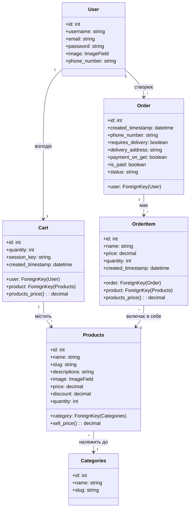

```mermaid
classDiagram
    %% Classes and Attributes
    class User {
        +id: int
        +username: string
        +email: string
        +password: string
        +image: ImageField
        +phone_number: string
    }

    class Products {
        +id: int
        +name: string
        +slug: string
        +descriptions: string
        +image: ImageField
        +price: decimal
        +discount: decimal
        +quantity: int
        +category: ForeignKey(Categories)
        +sell_price(): decimal
    }

    class Categories {
        +id: int
        +name: string
        +slug: string
    }

    class Cart {
        +id: int
        +user: ForeignKey(User)
        +product: ForeignKey(Products)
        +quantity: int
        +session_key: string
        +created_timestamp: datetime
        +products_price(): decimal
    }

    class Order {
        +id: int
        +user: ForeignKey(User)
        +created_timestamp: datetime
        +phone_number: string
        +requires_delivery: boolean
        +delivery_address: string
        +payment_on_get: boolean
        +is_paid: boolean
        +status: string
    }

    class OrderItem {
        +id: int
        +order: ForeignKey(Order)
        +product: ForeignKey(Products)
        +name: string
        +price: decimal
        +quantity: int
        +created_timestamp: datetime
        +products_price(): decimal
    }

    %% Relationships
    User "1" --> "*" Order : створює
    User "1" --> "1" Cart : володіє
    Cart "1" --> "*" Products : містить
    Order "1" --> "*" OrderItem : має
    OrderItem "*" --> "1" Products : включає в себе
    Products "*" --> "1" Categories : належить до
```
